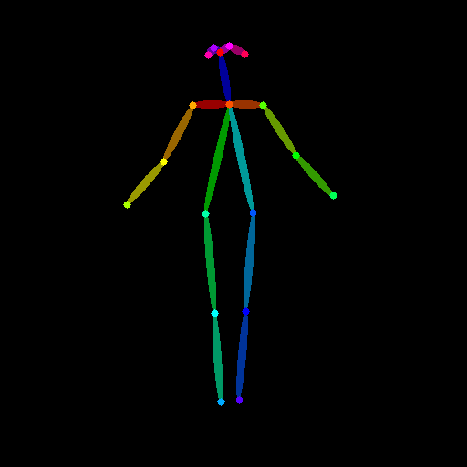
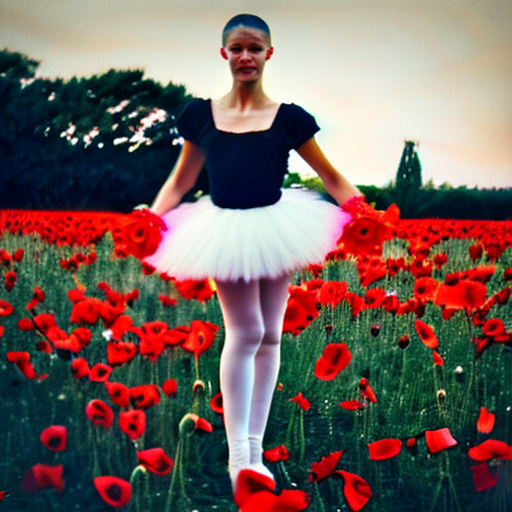
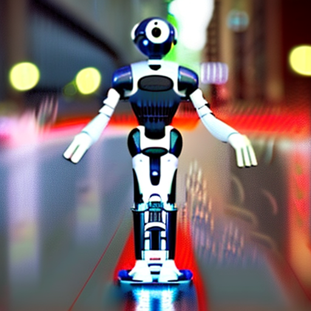
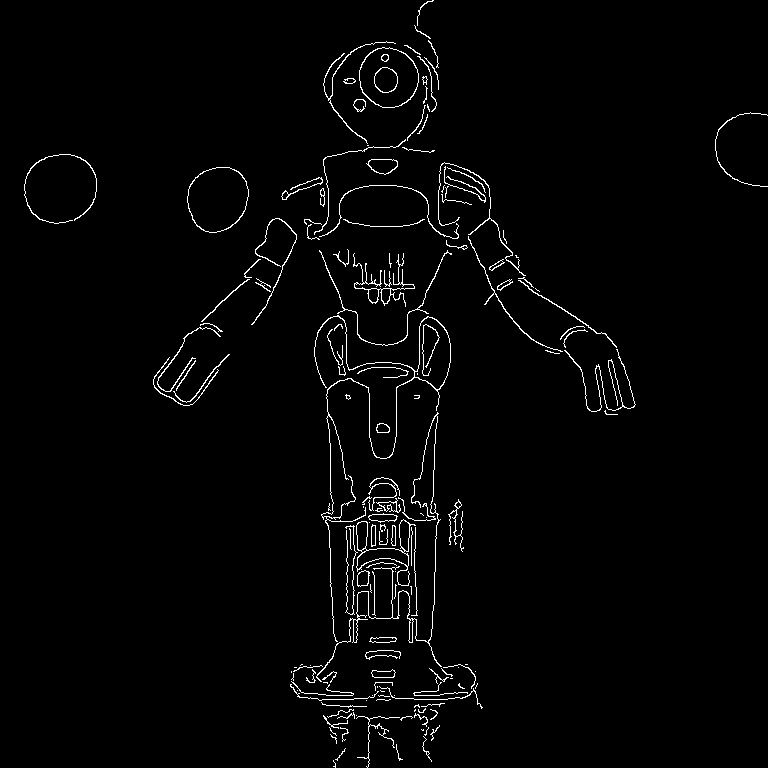

As of 18/07/2023 parts of contronet require some CPU fallback functions for MPS
before running thses scripts you will need to set PYTORCH_ENABLE_MPS_FALLBACK

`export PYTORCH_ENABLE_MPS_FALLBACK=1`

pose2img.py

Takes a pose picture, as output by openpose and uses it 'control' Stable Diffusion so something in the generated image will have the same pose.

The script requires transformers to be installed in your python environment

`pip install transformers`

img2pose2img.py 

Takes an image, extracts a pose image from it and then uses controlnet to generate a image from a prompt.

The script requires transformers, matplotlib and controlnet_aux to be installed in your python environment

`pip install transformers matplotlib controlnet_aux`

canny2img.py

Canny is an edge detection algorithm available in opencv. We can use the images generated by canny as input to controlnet
go generate images with the same basic shapes.

img2canny2img.py

Takes an image, runs it through canny to extract an outline, uses that to create a new image

